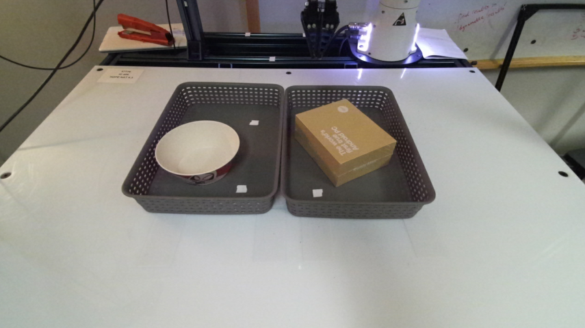
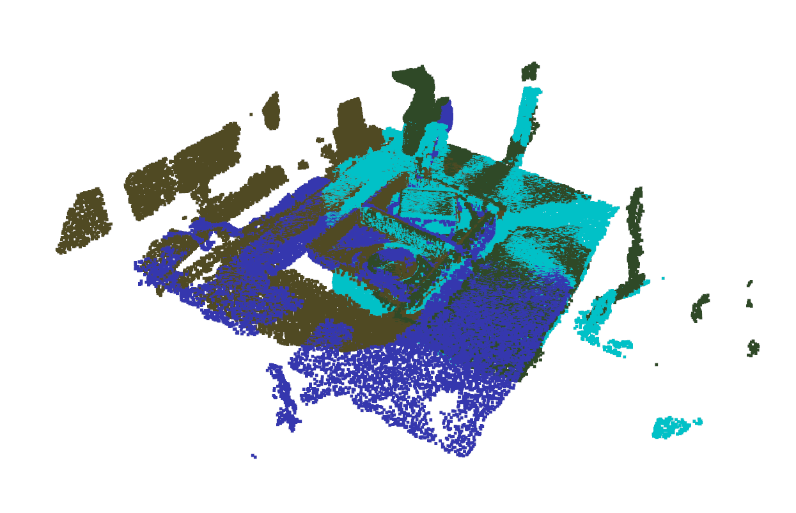
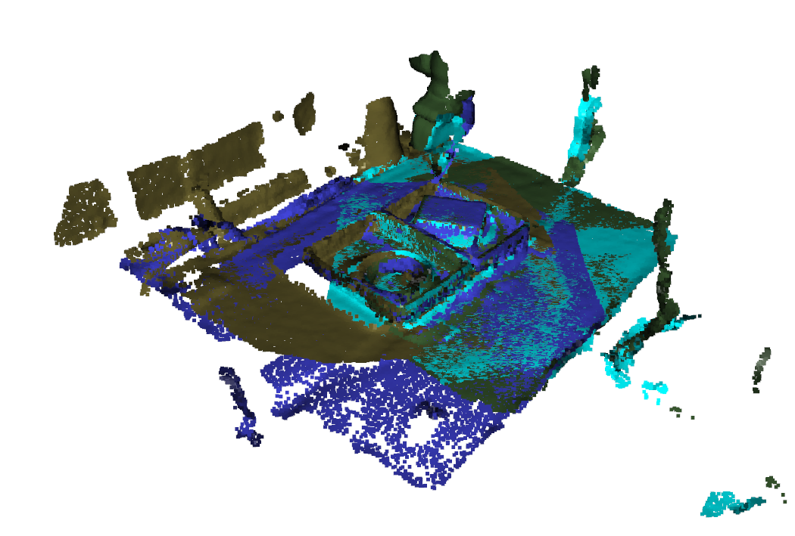
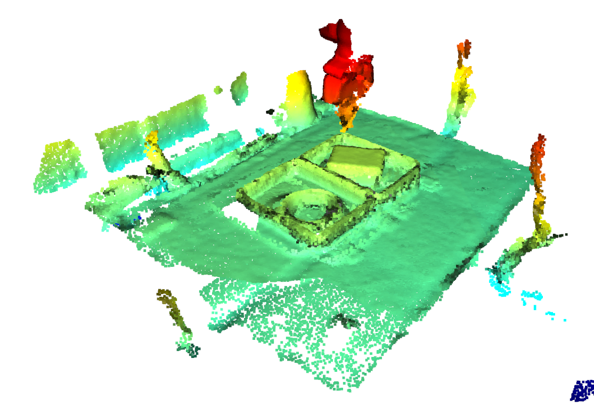
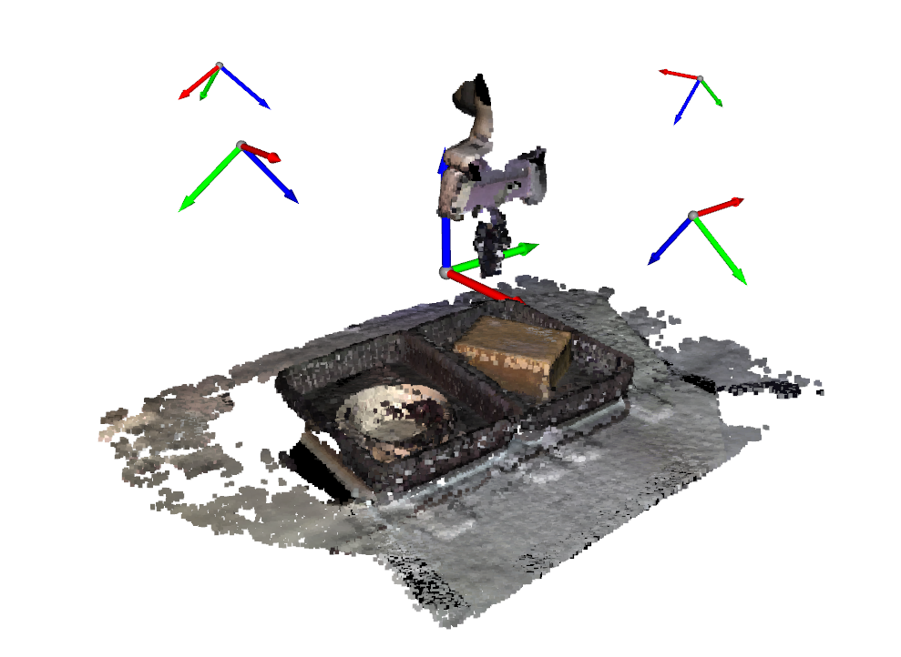

## Procedure of Camera Calibration

### Prerequisite

Make sure that `hacman_real_env` is installed. 

```
# Under the hacman_real_robot project root
pip install -e .
``````

----

**Note about compatibility with different setups:**

1. We mostly just need the robot_controller class in the `hacman_real_env` package, which is a wrapper around the deoxys controller. However, note that this controller can be swapped with other controllers as long as the controller can move the eef to different poses and read the eef poses.

2. In our setup, we use Azure kinect to collect IR image and aruco markers as the calibration target. Both can be modified for different hardware setups.

3. This script is created for eye-to-hand calibration, please adjust the pose sampling accordingly for eye-in-hand calibration (see below).

----

### Run data collection

**What you need to complete:**

1. **For each camera**, manually adjust the robot arm such that the marker mounted on the gripper appears at the center of the camera. Record the joint positions to be the reset joint positions by running `hacman_real_env/robot_controller/robot_controller.py`.

2. Replace the default reset joint positions in the collect data [script](https://github.com/JiangBowen0008/hacman_real_robot/blob/7ed085abc75111fb5d683ba58a366e83ffffcf47/hacman_real_env/pcd_obs_env/calibration/collect_data.py#L77). We used 4 cameras in our setup, you can adjust the `cam_id` and `initial_joint_positions` based on the number of cameras in your setup.

3. **If you are using eye-in-hand calibration**, the eef pose sampling should be changed to such that the mounted camera can always see the fixed checkerboard/marker on the table. See [this part of the code](https://github.com/JiangBowen0008/hacman_real_robot/blob/7ed085abc75111fb5d683ba58a366e83ffffcf47/hacman_real_env/pcd_obs_env/calibration/collect_data.py#L37).


**Now run the data collection script:**

```
python hacman_real_env/pcd_obs_env/calibration/collect_data.py
```

This script moves the eef to a random pose near the initial joint positions, records down the eef pose in the robot frame and the detected aruco marker pose (**left top corner**) in the camera frame, and saves the data in `calibration/data/cam[selected_cam_id]_data.pkl`.


----

### Solve for calibration

**What you need to complete:**

1. Our script assumes the eef-to-marker transform is known. Adjust [this transform](https://github.com/JiangBowen0008/hacman_real_robot/blob/7ed085abc75111fb5d683ba58a366e83ffffcf47/hacman_real_env/pcd_obs_env/calibration/solve_calibration.py#L7) in the `calibration/solve_calibration.py` script based on your setup.

2. **If you are using eye-in-hand calibration**, the eef-to-marker transform can be set to uniform.


**Run the following script to solve for calibration using the data previously collected.**

```
python hacman_real_env/pcd_obs_env/calibration/solve_calibration.py
```

This script solves the correspondence between tag in robot base (world frame) and tag in camera frame. The result is the extrinsic matrix we need that transform pcd in the camera

**Kabsch-Umeyama algorithm**

The script `solve_calibration.py` uses *Kabsch-Umeyama algorithm* to solve for the rigid transformation in the [`solve_rigid_transformation` method](https://github.com/JiangBowen0008/hacman_real_robot/blob/db245a7ea643597f147598c7da3188c9b0242d8c/hacman_real_env/pcd_obs_env/calibration/solve_calibration.py#L50). 

Suggested reading: [1](https://doi.org/10.6028/jres.124.028) or [2](https://math.nist.gov/~JBernal/kujustf.pdf)

----

### Multi-camera Alignment

If you have multiple cameras and you need to align them together, see `hacman_real_env/pcd_obs_env/debug_pcd_processing.ipynb` for detailed instructions.

#### Post-processing of Individual PCD

The first section of the ipynb is for testing parameters on post-processing PCD obs from each camera, e.g. downsampling, outlier removal.

#### Aligning multiple cameras

The second section of the ipynb is for aligning PCDs recorded by multiple cameras together using ICP.

**Notice:** When running this part of the code, make sure there are enough objects inside the observable workspace so that there are enough geometries for the ICP algorithm to align.

Below is the visualization of this procedure:

1. Place "enough objects inside the observable workspace":
<p align="center">
  
</p>

2. Before camera-alignment:
<p align="center">
  
</p>

3. After camera-alignment:
<p align="center">
  
  
</p>


### Verfication

To visually verify the calibration and alignment results, run `hacman_real_env/pcd_obs_env/pcd_obs_env.py`. You will be able to see a visualization of the combined pcd together with the coordinates of the origin and the estimated cameras poses of your setup.

Example:
<p align="center">
  
</p>


